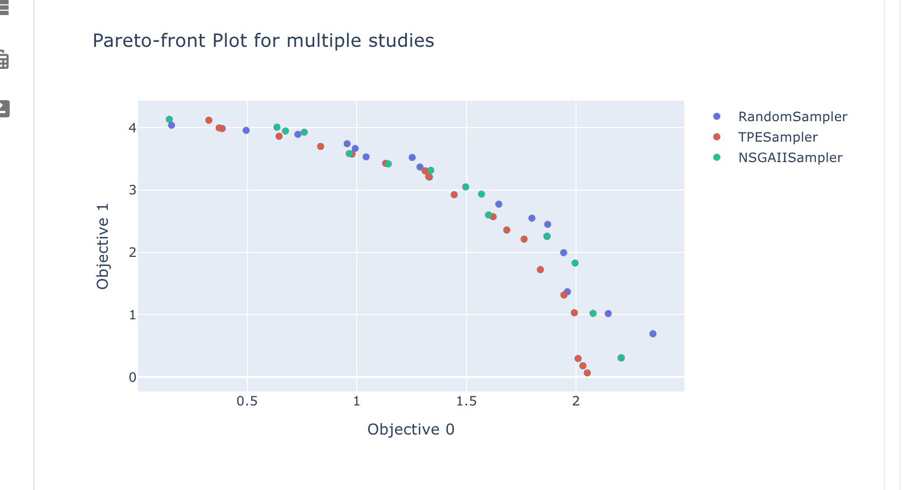

Tutorial: How to Plot in Optuna-Dashboard
=========================================

In this tutorial, you can learn how to display plots in `Optuna-Dashboard <https://optuna-dashboard.readthedocs.io/en/latest/index.html>`_.

You can use the function `optuna_dashboard.save_plotly_graph_object <https://optuna-dashboard.readthedocs.io/en/latest/_generated/optuna_dashboard.save_plotly_graph_object.html#optuna_dashboard.save_plotly_graph_object>`_ 
to integrate and display plots generated by Optunahub modules in Optuna-Dashboard.

Preparation
-----------

First, ensure the necessary packages are installed by executing the following command in your terminal:

.. code-block:: console

    $ pip install optuna optunahub optuna-dashboard

Example
-------

We are going to use `Plot Pareto Front for Multiple Studies <https://hub.optuna.org/visualization/plot_pareto_front_multi/>`_  as example.

.. code-block:: python

    import optuna
    import optunahub
    from optuna_dashboard import save_plotly_graph_object

    def objective(trial: optuna.Trial) -> tuple[float, float]:
        x = trial.suggest_float("x", 0, 5)
        y = trial.suggest_float("y", 0, 3)

        v0 = 4 * x**2 + 4 * y**2
        v1 = (x - 5) ** 2 + (y - 5) ** 2
        return v0, v1

    samplers = [
        optuna.samplers.RandomSampler(),
        optuna.samplers.TPESampler(),
        optuna.samplers.NSGAIISampler(),
    ]
    studies = []
    for sampler in samplers:
        study = optuna.create_study(
            sampler=sampler,
            study_name=f"{sampler.__class__.__name__}",
            directions=["minimize", "minimize"],
            storage=STORAGE_URL,
        )
        study.optimize(objective, n_trials=50)
        studies.append(study)

    m = optunahub.load_module(
        "visualization/plot_pareto_front_multi"
    )
    fig = m.plot_pareto_front(studies)

    save_plotly_graph_object(studies[0], fig)

Execute this, then start the Optuna-Dashboard by running the following command:

.. code-block:: console

    $ optuna-dashboard STORAGE_URL

Then, visit the page of the study you saved the plot.
You can see the plot in the dashboard like the image below.

