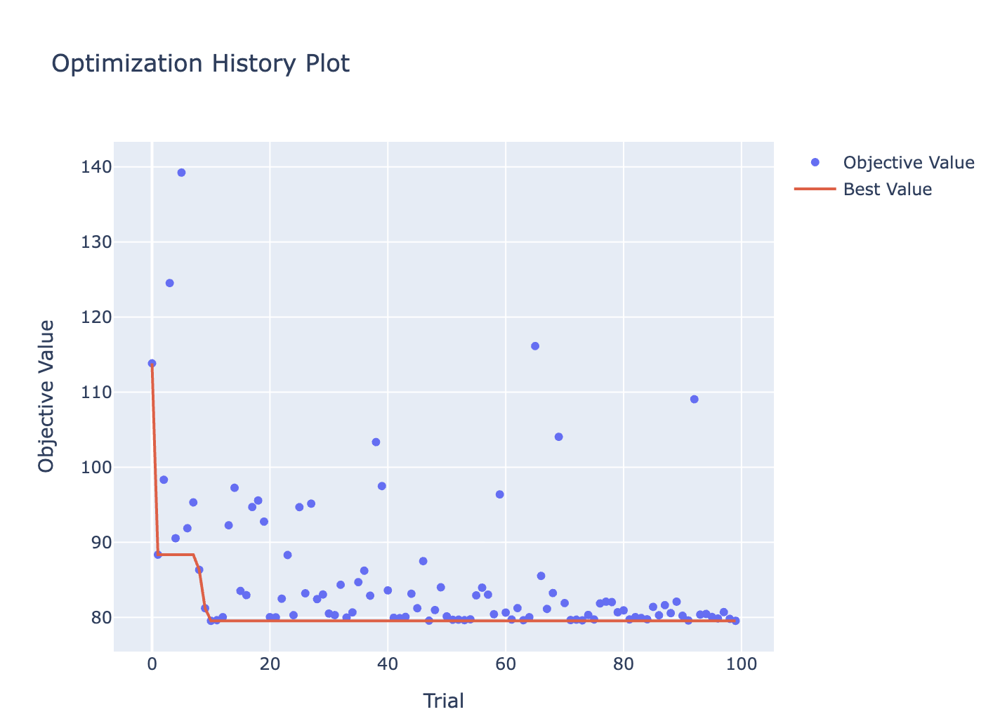
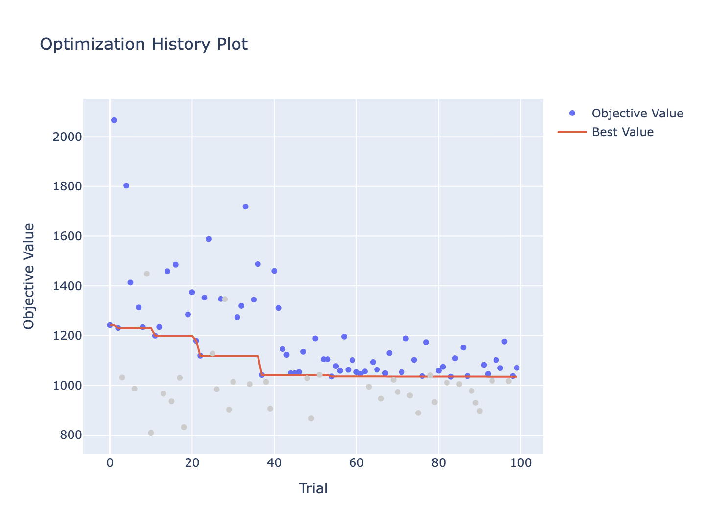
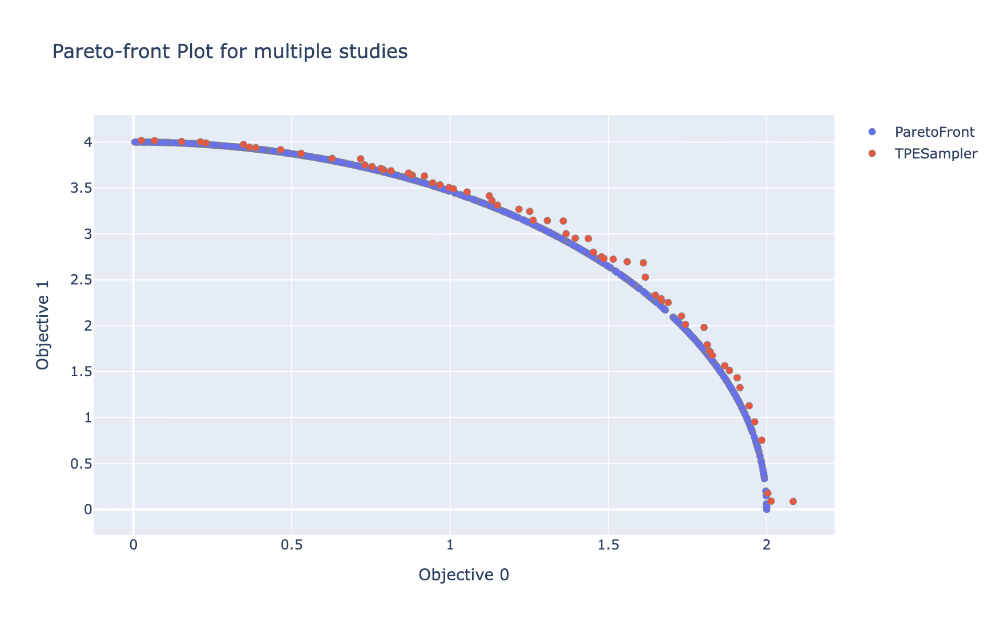

How to Use Benchmarks
=====================

OptunaHub provides various benchmarks, and you can utilize them through a unified interface.
In this tutorial, we will explain how to use benchmarks in OptunaHub.
If you are interested in registering your own benchmark problems, please check  `Basic <https://optuna.github.io/optunahub/recipes/006_benchmarks_basic.html>`_ and `Advanced <https://optuna.github.io/optunahub/recipes/007_benchmarks_advanced.html>`_ tutorials.

The following blog post also provides an overview of this feature:

- `OptunaHub Benchmarks: A New Feature to Use/Register Various Benchmark Problems <https://medium.com/optuna/optunahub-benchmarks-a-new-feature-to-use-register-various-benchmark-problems-694401524ce0>`__

Preparation
-----------

First, ensure the necessary packages are installed by executing the following command:

.. code-block:: console

    $ pip install optuna optunahub

Examples
--------

We will use the `black-box optimization benchmarking (bbob) test suite <https://hub.optuna.org/benchmarks/bbob/>`__ in this tutorial.
This is a wrapper of `COCO (COmparing Continuous Optimizers) experiment <https://github.com/numbbo/coco-experiment>`__ library.
So you need to install COCO first.

.. code-block:: console

    $ pip install coco-experiment

Test code is as follows:

.. code-block:: python

    import optuna
    import optunahub

    bbob = optunahub.load_module("benchmarks/bbob")
    sphere2d = bbob.Problem(function_id=1, dimension=2, instance_id=1)

    study = optuna.create_study(directions=sphere2d.directions, sampler=optuna.samplers.TPESampler(seed=42))
    study.optimize(sphere2d, n_trials=100)

    optuna.visualization.plot_optimization_history(study).show()

You can also use other optimizing frameworks to optimize the problem.
:class:`~optunahub.benchmarks.BaseProblem` provides :meth:`~optunahub.benchmarks.BaseProblem.__call__` and :meth:`~optunahub.benchmarks.BaseProblem.evaluate` methods, which is used to evaluate the objective function.
:meth:`~optunahub.benchmarks.BaseProblem.__call__` takes an :class:`optuna.Trial` object, while :meth:`~optunahub.benchmarks.BaseProblem.evaluate` takes a dictionary of input parameters.
Therefore, you can use :meth:`~optunahub.benchmarks.BaseProblem.evaluate` to optimize the problem with other optimizing frameworks.
Here, we use `scipy.optimize.minimize <https://docs.scipy.org/doc/scipy/reference/generated/scipy.optimize.minimize.html>`__ as an example.
The properties ``initial_solution``, ``lower_bounds``, and ``upper_bounds`` are provided by `the bbob package <https://hub.optuna.org/benchmarks/bbob/>`__.

.. code-block:: python
    
    import optunahub
    import scipy

    bbob = optunahub.load_module("benchmarks/bbob")
    sphere2d = bbob.Problem(function_id=1, dimension=2, instance_id=1)
    result = scipy.optimize.minimize(
        fun=lambda x: sphere2d.evaluate({f"x{d}": x[d] for d in range(sphere2d.dimension)}),
        x0=sphere2d.initial_solution,
        bounds=scipy.optimize.Bounds(
            lb=sphere2d.lower_bounds, ub=sphere2d.upper_bounds
        )
    )

Constrained Problem
^^^^^^^^^^^^^^^^^^^

Some benchmarks also include constraints. 
These problems are implemented by inheriting :class:`~optunahub.benchmarks.ConstrainedMixin` class.
:class:`~optunahub.benchmarks.ConstrainedMixin` provides :meth:`~optunahub.benchmarks.ConstrainedMixin.evaluate_constraints` and :meth:`~optunahub.benchmarks.ConstrainedMixin.constraints_func` methods.
As same as objective functions, :meth:`~optunahub.benchmarks.ConstrainedMixin.constraints_func` takes an :class:`optuna.Trial` object, while :meth:`~optunahub.benchmarks.ConstrainedMixin.evaluate_constraints` takes a dictionary of input parameters.
Those methods are used to evaluate the constraint functions.
You can optimize these problems in the same way as usual, but you need to set the ``constraints_func`` argument in the sampler.

.. code-block:: python

    import optuna
    import optunahub
    import matplotlib.pyplot as plt

    bbob_constrained = optunahub.load_module("benchmarks/bbob_constrained")
    constrained_sphere2d = bbob_constrained.Problem(function_id=1, dimension=2, instance_id=1)

    study = optuna.create_study(
        sampler=optuna.samplers.TPESampler(
            constraints_func=constrained_sphere2d.constraints_func,
            seed=42
        ),
        directions=constrained_sphere2d.directions
    )
    study.optimize(constrained_sphere2d, n_trials=100)
    optuna.visualization.plot_optimization_history(study).show()
    plt.show()

Multi-Objective Problem
^^^^^^^^^^^^^^^^^^^^^^^

You can also try multi-objective optimization. 
Here, we use the `the WFG Problem Collection <https://hub.optuna.org/benchmarks/wfg/>`__ as an example.
In order to use this module, you need to install `optproblems <https://pypi.org/project/optproblems/>`__ and `diversipy <https://pypi.org/project/diversipy/>`__ packages.

.. code-block:: console

    $ pip install -U optproblems diversipy

Example is as follows:

.. code-block:: python

    import optuna
    import optunahub

    wfg = optunahub.load_module("benchmarks/wfg")
    wfg4 = wfg.Problem(function_id=4, n_objectives=2, dimension=3, k=1)

    study = optuna.create_study(
        study_name="TPESampler",
        sampler=optuna.samplers.TPESampler(seed=42), directions=wfg4.directions
    )
    study.optimize(wfg4, n_trials=1000)

    optuna.visualization.plot_pareto_front(study).show()

Keep Exploring!
---------------

There are many kinds of benchmarks in OptunaHub.
You can find them in the `OptunaHub Benchmarks <https://hub.optuna.org/?q=Benchmark>`__ page.
