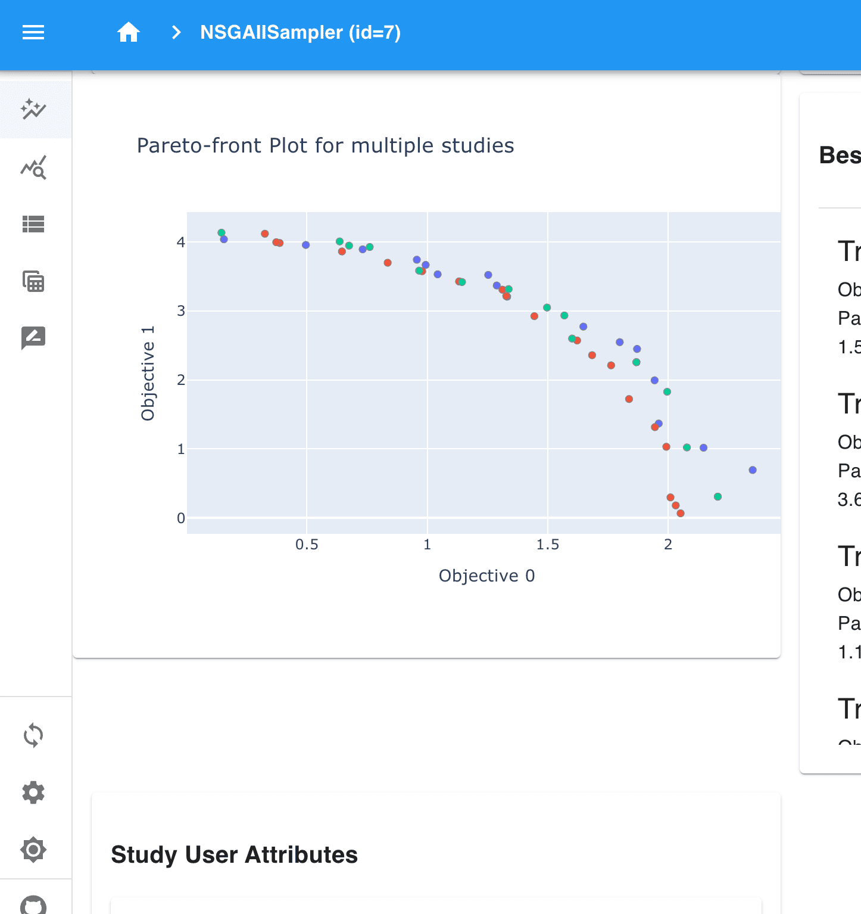

How to Plot in Optuna-Dashboard
===============================

In this tutorial, we will explain how to display plots in `Optuna-Dashboard <https://optuna-dashboard.readthedocs.io/en/latest/index.html>`_.

`optuna_dashboard.save_plotly_graph_object <https://optuna-dashboard.readthedocs.io/en/latest/_generated/optuna_dashboard.save_plotly_graph_object.html#optuna_dashboard.save_plotly_graph_object>`__ can be used 
to integrate and display plots generated by Optunahub modules in Optuna-Dashboard.

Preparation
-----------

First, ensure the necessary packages are installed by executing the following command:

.. code-block:: console

    $ pip install optuna optunahub optuna-dashboard

Example
-------

To illustrate an example, we use `The WFG Problem Collection <https://hub.optuna.org/benchmarks/wfg/>`__ and `Plot Pareto Front for Multiple Studies <https://hub.optuna.org/visualization/plot_pareto_front_multi/>`__.

.. code-block:: python

    import optuna
    import optunahub
    from optuna_dashboard import save_plotly_graph_object

    wfg = optunahub.load_module("benchmarks/wfg")
    wfg4 = wfg.Problem(function_id=4, n_objectives=2, dimension=3, k=1)

    samplers = [
        optuna.samplers.RandomSampler(),
        optuna.samplers.TPESampler(),
        optuna.samplers.NSGAIISampler(),
    ]
    studies = []

    for sampler in samplers:
        study = optuna.create_study(
            sampler=sampler,
            study_name=sampler.__class__.__name__,
            directions=wfg4.directions,
            storage="sqlite:///db.sqlite3",
        )
        study.optimize(wfg4, n_trials=100)
        studies.append(study)

    m = optunahub.load_module(
        "visualization/plot_pareto_front_multi"
    )
    fig = m.plot_pareto_front(studies)

    for study in studies:
        save_plotly_graph_object(study, fig)

After running this code, launch the Optuna-Dashboard by the following command:

.. code-block:: console

    $ optuna-dashboard sqlite:///db.sqlite3

Then, go to one of the study pages.
You can see the plot in the dashboard like the image below.

